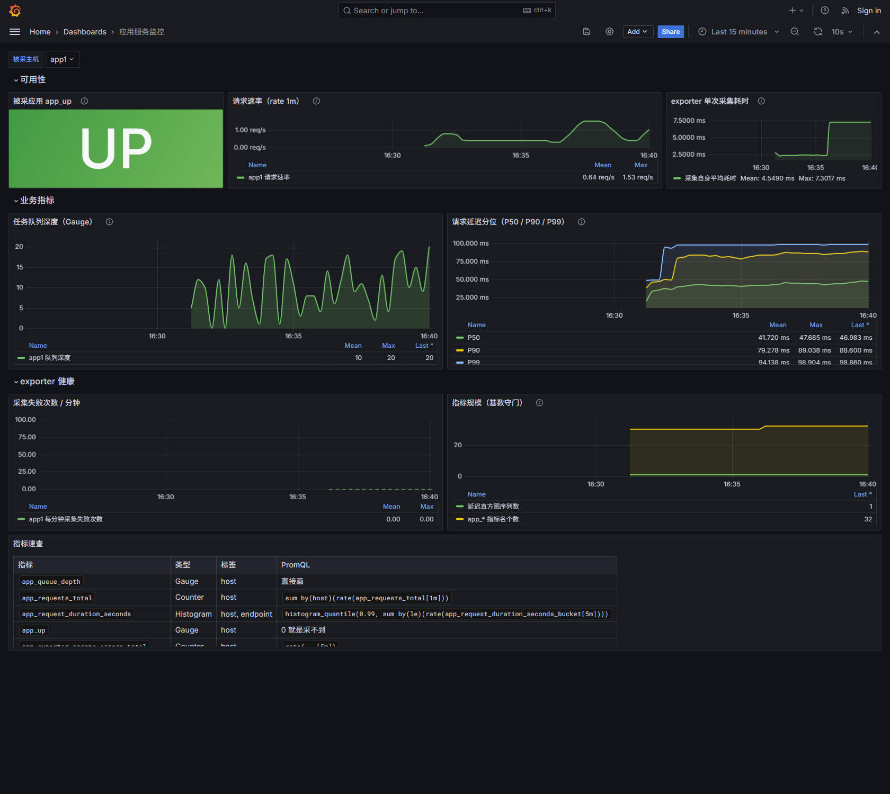

# prometheus-app-exporter

给 Flask 应用写的 Prometheus exporter。

node_exporter 采的是主机指标，mysqld_exporter 采的是数据库指标，
但应用自己的队列深度、请求数、接口延迟没有现成的 exporter 能采，所以自己写一个。

## 安装

```bash
pip install -r requirements.txt
```

## 用法

```bash
python app_exporter.py \
  --stats-url http://127.0.0.1/api/stats \
  --probe-base http://127.0.0.1 \
  --port 9877
```

然后 `curl http://127.0.0.1:9877/metrics`。

参数也可以用环境变量给（`APP_EXPORTER_PORT` 这种），写 systemd 的时候方便点，
全部参数看 `--help`。

不用装 Prometheus 也能试，仓库里带了个假应用：

```bash
python examples/mock_app.py &
python app_exporter.py --debug
```

Prometheus 那边加个 job 指过来就行：

```yaml
- job_name: app
  static_configs:
    - targets: ["127.0.0.1:9877"]
```

## 用 docker 起一整套

装了 Docker 的话，不用自己准备环境，一条命令把假应用、exporter、Prometheus、Grafana 全拉起来：

```bash
docker compose up -d
```

| 起来之后 | 地址 |
|---|---|
| exporter 的指标 | http://localhost:9877/metrics |
| Prometheus 抓取情况 | http://localhost:9090/targets |
| Grafana 面板 | http://localhost:3000（免登录，面板已经自动加载好） |

关掉：`docker compose down`

面板长这样（跑起来截的，不是画的）：



## 指标

| 指标 | 类型 | 标签 | 说明 |
|---|---|---|---|
| `app_queue_depth` | Gauge | host | 任务队列深度，来自应用的 /api/stats |
| `app_requests_total` | Counter | host | 应用累计请求数 |
| `app_request_duration_seconds` | Histogram | host, endpoint | 访问应用首页的端到端耗时 |
| `app_up` | Gauge | host | 应用是否可达，1=可达 0=采不到 |
| `app_exporter_scrape_errors_total` | Counter | host | 采集失败次数 |
| `app_exporter_scrape_duration_seconds` | Histogram | — | 自己采集一次花多久 |

## 两点要注意

`app_up` 说的是应用可不可达，跟 Prometheus 自己的 `up` 不是一回事，
`up` 只能说明 exporter 还活着。

采集失败的时候 Gauge 会保留上一次的值，所以图上的队列深度不会断，
数据新不新要看 `app_up`。

延迟是 exporter 自己发请求测的，应用里没有埋点。测的是单次串行请求，
看趋势没问题，别当压测数据用。

## 部署

```bash
sudo bash deploy/install.sh
```

装成 systemd 服务常驻。脚本是幂等的，重复跑不会覆盖已经改过的 `/etc/app-exporter.env`。

## 已知问题

只支持采一个实例，`host` 标签是写死的。多实例要改成读配置文件。

`experiments/cardinality_lab.py` 是写的时候顺手做的一个标签基数实验，
结论是标签值不能随便加，想看可以自己跑。

## 测试

```bash
pytest tests -v
```

## License

MIT
